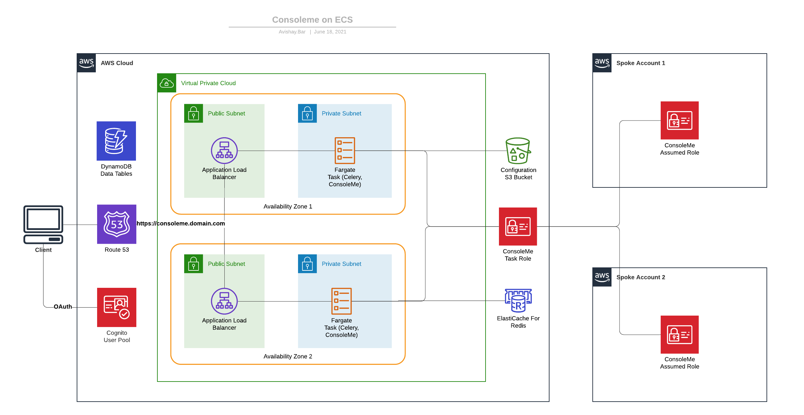

# Welcome to ConsoleMe CDK Deployment

## Motivation

ConsoleMe is a web service that makes AWS IAM permissions and credential management easier for end-users and cloud administrators.

The CDK deployment was created to help more people deploy ConsoleMe easily, authenticating with corporate
authentication tools and scaling without managing servers.

## Architecture

The main idea is to use serverless services in order to remove the need to manage servers.



## Usage

### Pre-requisites

- Domain name managed with a public hosted zone on AWS Route 53.
  Please collect this information and fill the `config.yaml` file with the hosted zone name and hosted zone id from Route 53.

  ```
  $ cp config.yaml.example config.yaml
  ```

  Here is a table with list of configuration keys:

| Configuration Parameter | Type   | Required | Description                                                                                |
| ----------------------- | ------ | -------- | ------------------------------------------------------------------------------------------ |
| domain_prefix           | string | True     | Used to segregate different environments                                                   |
| main_account            | string | True     | ConsoleMe main account ID                                                                  |
| spoke_accounts          | list   | False    | List of AWS child accounts that ConsoleMe manages                                          |
| hosted_zone_id          | string | True     | Route53 hosted zone ID used to generate HTTPS certs and serve ConsoleMe                    |
| hosted_zone_name        | string | True     | Route53 hosted zone name used to generate HTTPS certs and serve ConsoleMe                  |
| use_public_docker_image | bool   | True     | Whether to pull the official ConsoleMe docker image or to build it from the current branch |
| min_capacity            | int    | True     | Minimum number of tasks that ECS will scale from                                           |
| max_capacity            | int    | True     | Maximum number of tasks that ECS will scale to                                             |
| admin_temp_password     | string | True     | Initial password for Cognito admin user (You'll be asked to change it on the first login ) |
| jwt_secret              | string | True     | A url-safe secret that ConsoleMe use to generates authentication cookie                    |

In the config.yaml file, set a strong random password for the `admin_temp_password` key, and a different strong random
password for the `jwt_secret` key. You can use the following command to generate a strong random password:
`openssl rand -base64 16`.

- MacOS / Linux computer with Docker: https://docs.docker.com/get-docker/
- NodeJS 12 or later AWS CDK command line interface installed on your computer.
  You can easily install AWS CDK command line interface globally using `npm`:

  ```
  $ npm install -g aws-cdk
  ```

- Python 3.6 and up with Pipenv dependencies & virtual environment management framework.
  You can easily install Pipenv command line interface it using `pip`:

  ```
  $ pip install --upgrade pipenv
  ```

- Use Pipenv to create and activate your virutal environment:
  To initiate the virtualenv on MacOS and Linux and install the required dependencies:

  ```
  $ pipenv install --dev
  ```

  After the init process completes, and the virtualenv is created, you can use the following
  step to activate your virtualenv.

  ```
  $ pipenv shell
  ```

- Bootstrap the CDK environment using the `modern` bootstrap template.
  This is required for each AWS account separately in order to work with `cdk`.
  If you bootstrapped CDK before on the AWS region and every AWS account you wish to deploy ConsoleMe, this step is not required.

  ```
  $ cdk bootstrap --cloudformation-execution-policies arn:aws:iam::aws:policy/AdministratorAccess
  ```

### Preparing the CDK Environment

At this point you can now synthesize the CloudFormation template for this code.

```
$ cdk synth
```

To add additional dependencies, for example other CDK libraries, just add
them to your `setup.py` file and run `pipenv --lock && pipenv sync`
command.

### Deployment

You can now deploy all the CDK applications in all supported accounts:

First, deploy ConsoleMe to the main account.
While logged in to the main account, deploy `ConsoleMeECS` stack:

```
$ cdk deploy ConsoleMeECS
```

Then, deploy the trust role to the spoke accounts.
While logged in to each spoke account, deploy `ConsoleMeSpoke` stack:

```
$ cdk deploy ConsoleMeSpoke
```

Don't forget to approve the template and security resources before the deployment.
Deployment time for the main account should be less than 20 minutes.
You can control scaling of the ECS tasks amount on the `config.yaml` configuration file. The default is minimum of 2 tasks and maximum of 10 tasks.

### Docker

In order for the service to run, the ECS service containers will pull the compatible container image and provision containers according to the desired capacity.
For your convenience, by default we use the official `consoleme` docker image. However, you can configure the CDK deployment to build the current branch of `consoleme` and package it as a docker image hosted on ECR by modifying the `use_public_docker_image` parameter.

### ConsoleMe Admin User

The CDK stack will provision the ConsoleMe administrator user. The user name supplied with this template is `consoleme_admin`.
You can set the user temporary password in the `config.yaml` file, login and update it afterwards (Cognito will ask you to do that).

## Security

- You should configure the admin user temporary password on the `config.yaml` file.
- You should set a new JWT secret for authentication purposes on the `config.yaml` file.
- During the deployment, a configuration file with all the relevant secrets is created and stored on an S3 bucket.
- Authentication to the ConsoleMe is done by AWS Cognito user pool.
- ECS containers are running in non-privileged mode, according to the docker best practices.
- During the deployment time, the cdk stack will try to determine your public ip address automatically using `checkip.amazonaws.com`.
  Then, it would add only this ip address to the ingress rules of the security group of the public load balancer.
- TLS termination are being done on the application load balancer using A SSL certificate generated on the deployment time by CDK, with DNS record validation on the configured hosted zone.
- Permanent resources, such as CMK, and Cognito User Pool are defined to be destroyed when the stack is deleted.
- Log groups retention are set to one week.
- Secret manager integration, instead of storing secrets like `jwt_secret` and `oidc_secrets` in clear text on the configuration file.

## Issues / Todo

- Allow adjusting compute sizes via configuration, such as Redis node size and containers CPU and RAM allocation.
- Elasticache authentication, rather than relying only on security groups for increased security.
- Separate task definitions for celery and ConsoleMe applications.
