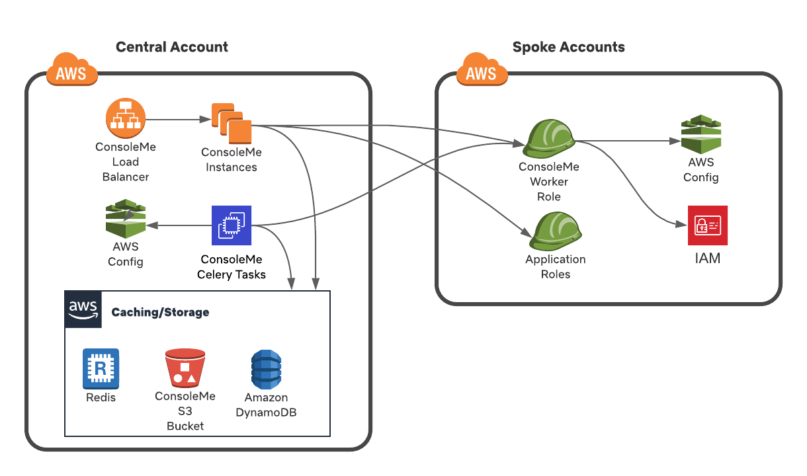

# Architecture

ConsoleMe is a Python Tornado web application backed by Redis, DynamoDB, and \(optionally\) S3. For local development, our [docker-compose-dependencies.yaml file](https://github.com/Netflix/consoleme/blob/master/docker-compose-dependencies.yaml) can be used for local DynamoDB and Redis.

## Hub and Spoke Model

ConsoleMe utilizes a hub and spoke architecture. The "Hub Account" is the account you have ConsoleMe on. 
The "Hub Role" (also called the "Central Role") is what ConsoleMe uses. This role is directly attached to the
EC2 instances or ECS/K8s containers that ConsoleMe is running on. There is only one Hub Role per deployment of ConsoleMe.

There should be one "Spoke Role" on each of your AWS accounts, including on the Hub Account. ConsoleMe will use its 
Hub Role to assume the Spoke Roles across your various accounts to cache resources or update permissions.

The required IAM permissions for the Hub and Spoke roles are [here](prerequisites/required-iam-permissions/README.md).

The one exception to the hub-and-spoke model is when ConsoleMe is brokering credentials to roles, to either provide 
AWS console access or CLI credentials through Weep. In this case, ConsoleMe's Hub Role needs direct access to assume
the requested role in order to broker credentials.

## DynamoDB Tables

ConsoleMe makes use of several DynamoDB tables. If you plan to have a multi-region deployment of ConsoleMe, you must make these DynamoDB tables **global** in your production environment. The configuration of these tables is defined [here](https://github.com/Netflix/consoleme/blob/master/scripts/initialize_dynamodb_oss.py).

| Table Name | Table Contents |
| :--- | :--- |
| consoleme\_iamroles\_global | A cache of your IAM roles. |
| consoleme\_config\_global | ConsoleMe's [Dynamic Configuration](configuration/dynamic-configuration.md) |
| consoleme\_policy\_requests | User-submitted policy requests |
| consoleme\_resource\_cache | Resources cached from [AWS Config](configuration/resource-syncing.md) |
| consoleme\_cloudtrail | An aggregation of recent cloudtrail errors associated with your resources. \(Note: The OSS code will not generate this for you yet\) |

## Redis

Redis is used to cache content for quick retrieval by the frontend. By default, this information is cached in the default redis logical database \(0\).

Redis is also used by the Celery Beat scheduler and workers to negotiate and execute Celery tasks. By default, ConsoleMe will assign logical database 1 for this purpose.

Here is a **non-exhaustive** list of the common redis keys and expected values that you might find in your redis cache:

| Key | Description |
| :--- | :--- |
| ALL\_POLICIES | A json listing of all roles and resources used for the `/policies` endpoint. |
| CREDENTIAL\_AUTHORIZATION\_MAPPING\_V1 | A cache of your [credential authorization mapping](configuration/role-credential-authorization/) \(ie: Which users and groups are allowed to retrieve credentials for which roles\) |
| AWSCONFIG\_RESOURCE\_CACHE | A [cache of the resources](configuration/resource-syncing.md) discovered by querying AWS Config |
| SNS\_TOPICS | A list of SNS topics discovered by querying SNS across your accounts. |
| ALL\_POLICY\_REQUESTS | A list of all historic policy requests used by the `/requests` endpoint |
| ALL\_AWS\_ACCOUNTS | A list of all of your valid [AWS accounts](configuration/account-syncing.md) |
| IAM\_MANAGED\_POLICIES | A list of all of your IAM managed policies. This is used to populate the managed policy typeahead in ConsoleMe's policy editor. |
| IAM\_ROLE\_CACHE | A list of all of your IAM roles and their known state. This is used to quickly retrieve information about a role. |

## S3

Data typically stored to Redis can also be stored in S3. This is useful if you want to make use of this data outside of ConsoleMe, or if you want a way to quickly and easily restore data that isn't in Redis.

