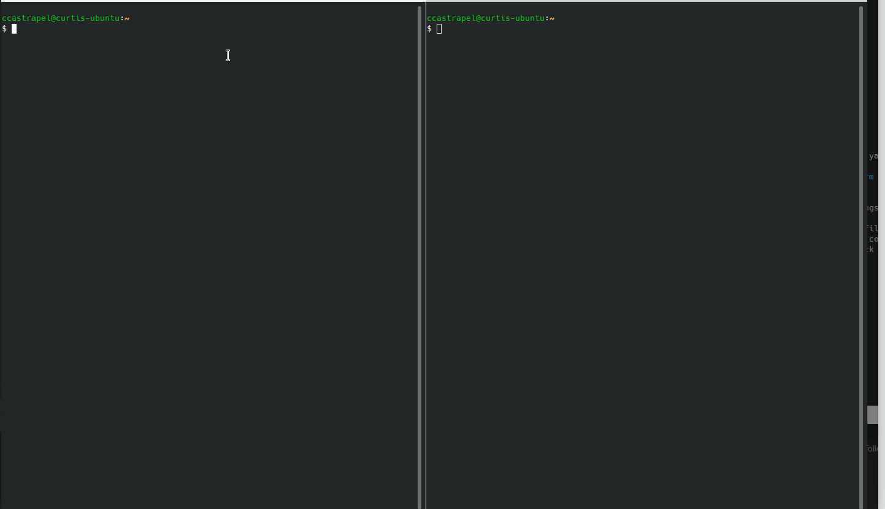

# CLI

[Weep](https://github.com/Netflix/weep) is the official CLI utility for ConsoleMe. The author has neglected to open source this yet. Please ask him to OSS it.

Weep can export credentials as environmental variables, or host a local IMDS metadata proxy for local development. In IMDS proxy mode, ConsoleMe will attempt to refresh your credentials automatically prior to expiration.

