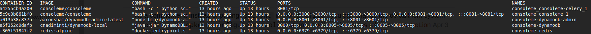

# Docker

## Docker

Docker-Compose is the quickest way to get ConsoleMe up and running locally for **testing** purposes. For **development**, we highly recommend setting up ConsoleMe [locally](local-development.md). The Dockerfile is a great point of reference for the installation process. If you are going to deploy ConsoleMe in a production environment, we recommend deploying it to an isolated, locked-down AWS account with a configuration that enables authentication.

1. Install [**git**](https://git-scm.com/book/en/v2/Getting-Started-Installing-Git), [**docker**](https://docs.docker.com/get-docker/), and [**docker-compose**](https://docs.docker.com/compose/install/) \*\*\*\*on your system, consider following [Docker's post-installation steps for Linux](https://docs.docker.com/engine/install/linux-postinstall/), then clone ConsoleMe locally in a directory of your choosing via HTTPS or SSH:

```text
# If you have a fork, you'll want to clone it instead

git clone https://github.com/Netflix/consoleme.git ;
# OR #
git clone git@github.com:Netflix/consoleme.git ;
```

2. Create a suitable configuration or use the samples provided in the repository [here](https://github.com/Netflix/consoleme/tree/master/example_config).
3. Make sure to have the following lines in your configuration and replace the regions according to your setup if you use the local Redis and dynamodb containers.

```yaml
celery:
  broker:
    us-east-1: redis://consoleme-redis:6379/1
    us-west-2: redis://consoleme-redis:6379/1
    global: redis://consoleme-redis:6379/1
  backend:
    us-east-1: redis://consoleme-redis:6379/2
    us-west-2: redis://consoleme-redis:6379/2
    global: redis://consoleme-redis:6379/2
  debug: true

redis:
  host:
    us-east-1: consoleme-redis
    us-west-2: consoleme-redis
    global: consoleme-redis
  db: 0
  port: 6379
```

4. Upload the config to amazon S3
5. Create an environment file with the following line

```text
CONFIG_LOCATION=<S3-URI-of-the-config>
EC2_REGION=<custom-AWS-region>
```

> Note: EC2\_REGION is an optional variable. This is only required if you want to use AWS managed dynamodb service and make the dynamodb tables in region other than us-east-1.


**BEFORE RUNNING THE COMMAND BELOW**: We highly recommend that you put valid AWS credentials for your account in your `~/.aws/credentials` file under the `[default]` profile \([Instructions](https://docs.aws.amazon.com/cli/latest/userguide/cli-configure-files.html#cli-configure-files-where)\). The role you use should have the permissions outlined under [Central Account IAM Permissions](../prerequisites/required-iam-permissions/central-account-consolemeinstanceprofile.md). These credentials will be shared with the container, and when you run the second command to populate your Redis cache \(`make redis`\) command using docker exec, the command will attempt to populate your Redis cache with live resources from your account. This will only work if you have valid AWS credentials.


6. To start up ConsoleMe in docker, run the following commands:

```bash
# Change to the consoleme directory
cd consoleme

# Pull the latest docker images from dockerhub
docker-compose -f docker-compose-dockerhub.yaml -f docker-compose-dependencies.yaml pull

# Start the containers, make sure to specify the path to the environment file you created in step 5
docker-compose --env-file=<path-to-your-env-file>  -f docker-compose-dockerhub.yaml -f docker-compose-dependencies.yaml up -d
```

If you wish to build ConsoleMe instead of using a pre-built image, run this command:

```bash
docker-compose -f docker-compose.yaml -f docker-compose-dependencies.yaml up -d
```


If you are building a ConsoleMe docker image locally and see multiple **ReadTimeoutErrors** while fetching Python dependencies, you'll want to ensure that the MTU for your Docker network interface is lower than the MTU on your host interface. Read more about this issue [here](https://civo.com/learn/fixing-networking-for-docker).


At this point you should the below command and verify you have 5 ConsoleMe related containers running.

* consoleme-celery
* consoleme
* dynamodb-local
* dynamodb-admin
* redis:alpine

```bash
docker ps
```

Your output should resemble the following screenshot:



If you do not have 5 containers running, rerun the docker-compose command to ensure they are started.


If your container crashes after starting, if you see a white screen when trying to load the ConsoleMe web UI, or if you see an "inotify watch limit reached" error in your docker logs, make sure that you have sufficient resources in Docker.

On Mac, configure Docker Desktop to provide at least 4GB RAM, 2 CPUs, 2GB of swap, and at least 25GB for storage.

On Linux, you may need to increase your inotify settings on your Docker host:

```bash
echo fs.inotify.max_user_watches=524288 | sudo tee -a /etc/sysctl.conf

echo fs.inotify.max_user_instances=512 | sudo tee -a /etc/sysctl.conf

sudo sysctl -p
```

If the containers are still not starting, please open a GitHub issue and paste your container logs.


After this is done, wait a bit for the containers to start fully. Run `docker logs <container_id>` to check progress and observe errors from the running ConsoleMe containers.

`http://localhost:3000`. You may notice the page is rather empty. One of the containers we started should be initializing your Redis cache with your AWS account resources, so you may need to give it a moment. To follow along with resource caching, run the following docker command:

```text
docker container logs -f consoleme_consoleme-celery_1
```

By default, you're running ConsoleMe as an administrator, using the local [Docker development configuration](https://github.com/Netflix/consoleme/blob/master/example_config/example_config_docker_development.yaml)**.** This configuration does not implement authn/authz and is not intended to be used in a production environment.

If successful, ConsoleMe should have been able to cache all of your resources. But you'll notice that you're unable to access any IAM roles with the default configuration. You'll need to follow the guidance under [Role Credential Authorization](../configuration/role-credential-authorization/) to grant access to role credentials to your users and/or the groups they are members of.

## Create your Configuration

At this point, you'll want to configure ConsoleMe to suit your needs. Read up on [ConsoleMe’s yaml configuration.](../configuration/) ConsoleMe can be configured to [authenticate your users via SAML, OIDC, header authentication, or it can bypass authentication altogether](../configuration/authentication-and-authorization/).

To get started, copy [this configuration](https://gist.github.com/castrapel/888cd106d12523a5445bf6f3cf9c810b). Read through the configuration and change the values to suit your environment. Then, set the `CONFIG_LOCATION` environment variable to the full path of your configuration file, or copy the configuration to one of the locations ConsoleMe will load from \(described [here](https://app.gitbook.com/@hawkins/s/consoleme/~/drafts/-MUCSXyHqSfyDOwV-0Mc/configuration)\).

